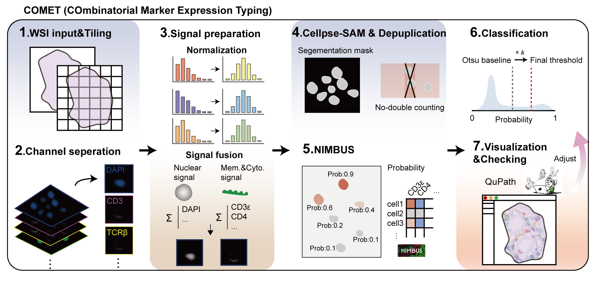

# COMET — COmbinatorial Marker Expression Typing

A computational pipeline for accurate quantification of rare immune cell populations in multiplexed immunohistochemistry (mIHC) whole-slide images.

COMET integrates [CellposeSAM](https://github.com/MouseLand/cellpose) and [NIMBUS](https://github.com/angelolab/nimbus-inference) with three targeted improvements designed for multi-marker rare-cell phenotyping in tissue sections.

Developed in the **[Francis Chan Lab](https://francischanlab.com/)**, Liangzhu Laboratory, Zhejiang University.

---

## Core Improvements

| Improvement | Problem Solved |
|---|---|
| **Normalized signal fusion** (`signal_prep`) | Direct channel addition allows bright markers to dominate segmentation input; per-channel percentile normalization ensures equal contribution from each marker |
| **Tile overlap deduplication** (`deduplication`) | Nimbus has no built-in tile stitching; cells in overlapping regions are double-counted without correction |
| **Otsu × factor thresholding** (`threshold`) | Standard Otsu thresholding on predictions from Nimbus output fails when positive cells are rare (<1%); a per-marker multiplicative correction factor adjusts classification stringency |

---

## Pipeline



---

## Installation

```bash
# 1. Create environment (Python 3.10 recommended)
conda create -n comet python=3.10
conda activate comet

# 2. Install CellposeSAM (GPU recommended)
pip install cellpose
# For GPU: follow https://github.com/MouseLand/cellpose#gpu-version

# 3. Install NIMBUS
pip install nimbus-inference

# 4. Install COMET
pip install -e .
```

---

## Notebook

For interactive use, JupyterLab or Jupyter Notebook is recommended.

The recommended end-to-end notebook is:

```text
./notebooks/1_COMET_Workflow.ipynb
```

This notebook walks through the full slide-level workflow from raw multiplex whole-slide images to final NIMBUS marker probabilities:

1. Stage 1: inspect OME metadata from the first raw slide, confirm channel order, then run image tiling, channel extraction, and Cellpose input preparation
2. Stage 2: run CellposeSAM segmentation on the 2-channel fused TIFF inputs
3. Stage 3: remove edge-touching masks and deduplicate overlapping cells across neighboring FOVs
4. Stage 4: run NIMBUS marker probability inference on the final masks and per-marker TIFFs

The Stage 1 notebook flow is intentionally split into two user steps:
- first print the metadata of the first raw slide
- then let the user fill `CHANNEL_NAMES` manually before running preprocessing

`CHANNEL_NAMES` must follow the raw acquisition order reported by the metadata inspection cell. If you only provide the first `N` names, COMET exports the first `N` raw channels and ignores the remaining trailing channels.

The notebook expects raw slides to be placed under an experiment directory such as:

```text
data/example/
|-- Slide1.ome.tif
|-- Slide2.ome.tif
|-- ...
```

After Stage 1, COMET creates one slide folder per raw image and writes tiled FOVs, per-marker TIFFs, and Cellpose inputs into the standard COMET directory structure used by the later stages.

## Quick Start

```python
import comet

# Step 1: Tile the whole-slide image
comet.tile_experiment(
    experiment_dir="my_experiment",
    suffix=".ome.tif",
    tile_size=1024,
    overlap=102,
)

# Step 2: Extract channels (check channel order first)
comet.print_channel_metadata("my_experiment/Slide1.ome.tif")
comet.extract_channels_experiment(
    experiment_dir="my_experiment",
    channel_names=["DAPI", "NuclearMarker", "MemMarker1", "MemMarker2", "Marker"],
)

# Step 3: Prepare CellposeSAM input (normalized signal fusion)
comet.prepare_cellpose_inputs(
    base_dir="my_experiment/Slide1",
    nuclear_markers=["DAPI", "NuclearMarker"],
    membrane_markers=["MemMarker1", "MemMarker2"],
)

# Step 4: Run CellposeSAM (GPU recommended)
comet.run_cellpose_slide("my_experiment/Slide1")

# Step 5: Border clearing + overlap deduplication
comet.deduplicate_slide("my_experiment/Slide1")

# Step 6: NIMBUS marker probability scoring
comet.run_nimbus_slide(
    slide_dir="my_experiment/Patient1",
    include_channels=["MemMarker1", "MemMarker2", "NuclearMarker", "Marker"],
)

# Step 7: Classify and assign cell types
result = comet.threshold_slide(
    nimbus_csv="my_experiment/Slide1/nimbus_output/nimbus_cell_table.csv",
    markers=["MemMarker1", "MemMarker2", "NuclearMarker", "Marker"],
    # col_map only needed if NIMBUS column names differ from Prob_{marker}
    # e.g. col_map={"MemMarker1": "Prob_Mem1"}
)

# Step 8: Export to QuPath
comet.export_to_qupath(
    classified_csv="my_experiment/Slide1/nimbus_output/nimbus_cell_table_classified.csv",
)
```

---

## QuPath integration

COMET also includes a QuPath script for reconstructing whole-slide detections directly from the final COMET outputs:

```text
./Qupath/Import COMET masks and NIMBUS predictions into QuPath.groovy
```

This script is intended for the final QuPath-side step after segmentation, deduplication, and NIMBUS inference are complete. It uses:

- `fov_coordinates.csv` to place each field of view back into whole-slide coordinates
- `segmentation/deepcell_output/` to import the final whole-cell masks
- `nimbus_output/nimbus_cell_table.csv` to attach NIMBUS prediction values to each imported cell as QuPath measurements

Typical usage in QuPath:

1. Open the corresponding whole-slide image.
2. Edit the `slideDir` variable in the script so it points to the COMET slide output directory, for example `my_experiment/Slide1`.
3. Run `Import COMET masks and NIMBUS predictions into QuPath.groovy` from the QuPath script editor.

After import, each cell detection in QuPath retains the NIMBUS-derived prediction columns as measurements. These imported prediction values can be used for downstream manual gating, measurement-based filtering, or additional cell classification steps within QuPath.

If you want to refine phenotyping interactively, QuPath can be used to create new PathClasses, threshold prediction columns, or define additional rule-based cell classes on top of the imported NIMBUS predictions.

---

## Output layout

```text
my_experiment/
|-- Slide1.ome.tif
|-- Slide1/
|   |-- fov_coordinates.csv
|   |-- Tiles/
|   |   |-- FOV0.tif, FOV1.tif, ...
|   |-- image_data/
|   |   |-- FOV0/
|   |   |   |-- DAPI.tif
|   |   |   |-- Marker.tif
|   |   |   |-- ...
|   |-- segmentation/
|   |   |-- cellpose_input/          # 2-channel fused TIFF inputs for CellposeSAM
|   |   |-- cellpose_output/         # raw Cellpose output artifacts
|   |   |-- deepcell_output/         # renamed whole-cell masks; deduplicated in place later
|   |   |-- deepcell_output_bak/     # backup created during deduplication
|   |-- nimbus_output/
|   |   |-- nimbus_cell_table.csv
|   |   |-- nimbus_cell_table_classified.csv
|   |   |-- thresholds_used.csv
|   |   |-- threshold_distributions.png
```

---

## Repository structure

```text
comet/
|-- __init__.py
|-- preprocessing/
|   |-- __init__.py
|   |-- tile_split.py       # WSI tiling
|   |-- channel_extract.py  # channel extraction and metadata-based channel handling
|   |-- pipeline.py         # notebook-facing Stage 1 helpers
|-- segmentation/
|   |-- __init__.py
|   |-- signal_prep.py      # normalized signal fusion
|   |-- run_cellpose.py     # CellposeSAM wrapper
|   |-- deduplication.py    # border clearing + overlap deduplication
|   |-- run_nimbus.py       # NIMBUS wrapper
|-- classification/
|   |-- __init__.py
|   |-- threshold.py        # Otsu × factor thresholding + cell typing
|-- export/
|   |-- __init__.py
|   |-- qupath_export.py    # QuPath TSV export
```

---

## Contributing

COMET is open for community use. If you encounter bugs, have questions, or want to suggest improvements, please open a [GitHub Issue](https://github.com/jiaqi-bio/COMET/issues). Pull requests are also welcome.

---

## Citation

If you use COMET in your research, please cite:

> [An IL-10 Driven Spatial Niche Regulates Efferocytosis During Resolution of Intestinal Tissue Inflammation] — Francis Chan Lab, Liangzhu Laboratory, Zhejiang University.

---


## Acknowledgements

- [CellposeSAM](https://github.com/MouseLand/cellpose) — Pachitariu et al., 2025
- [NIMBUS](https://github.com/angelolab/nimbus-inference) — Rumberger, Greenwald et al., *Nature Methods*, 2025
